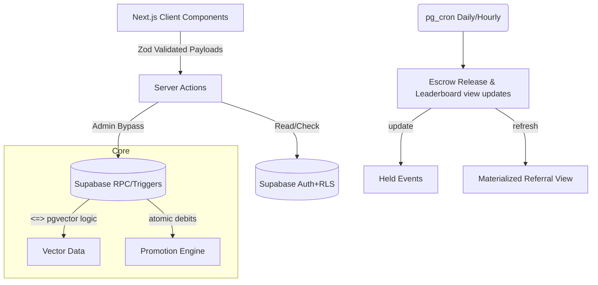

# SyncUp Architecture Overview

## Data Flow Diagram

## Anti-Spoof Architecture

The core of the system depends on avoiding impersonation attacks during face capture:
1. **TinyFaceDetector**: Locates bounding boxes locally.
2. **WebGL Context Patching**: We compute the Laplacian Frequency on a 64x64 sub-patch over the face bounding box. If frequency variance falls beneath `14`, the texture is flagged as a 2D physical photo.
3. **Hue Deviation**: Used specifically to trap B&W generated masks and printer distortions.
4. **pg_vector RPC Matching**: Client pushes a 128-float dimensional matrix directly to PostgreSQL. We bypass Javascript entirely here to let the C-compiled vector ops within PostgreSQL query our ivfflat index avoiding expensive round trips and memory leaks over V8.

## Promotion Atomic Bids

We opted to decouple incrementation and validation using: `debit_campaign_budget(id, cost)` which runs `FOR UPDATE` cursor locking the row synchronously stopping concurrency overwrites in high-throughput advertising impression injections on feed endpoints.
